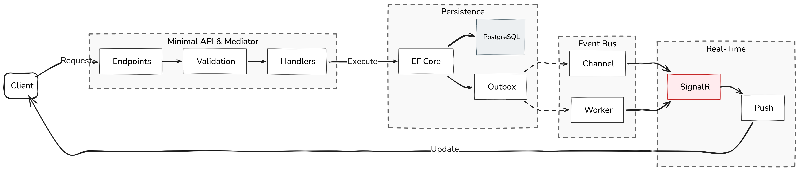
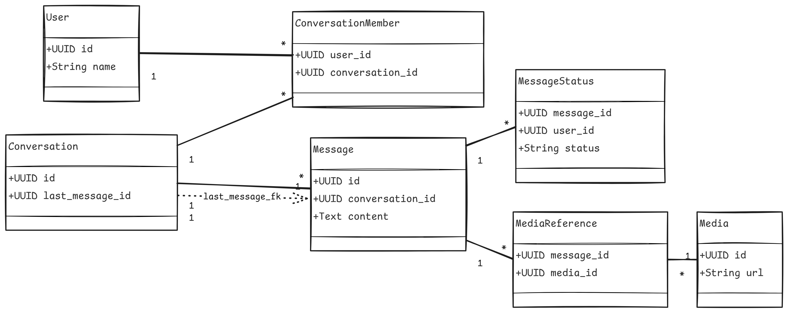
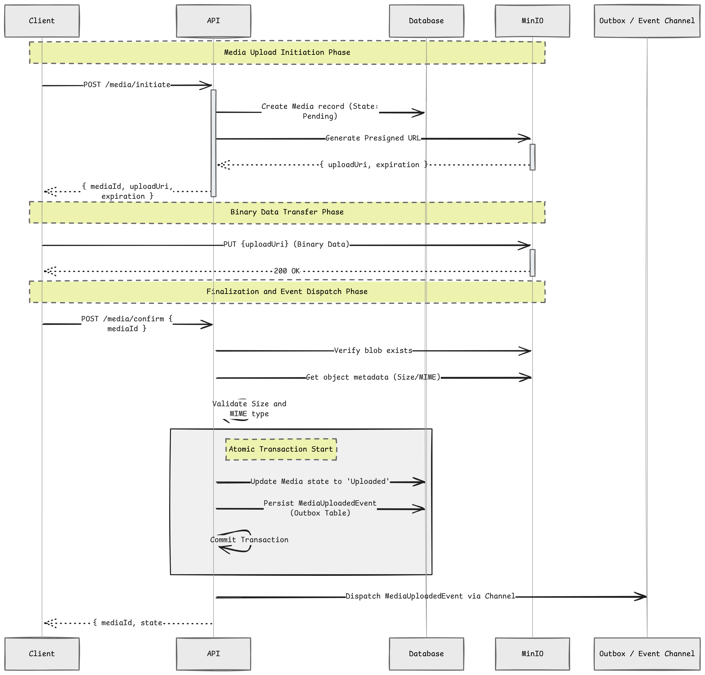
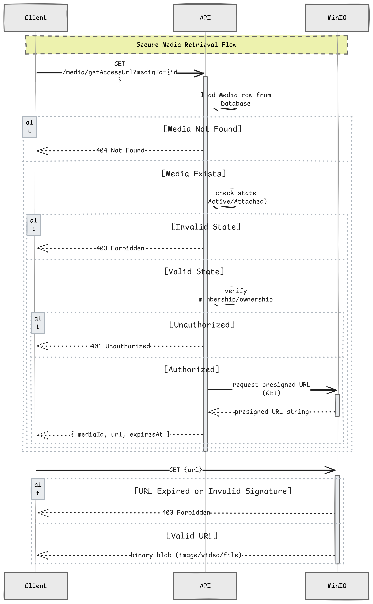

# SyncChat.Backend

A production-style real-time chat backend demonstrating Vertical Slice Architecture, a custom mediator pipeline, transactional outbox, and SignalR-based event-driven messaging using .NET 9 Minimal API.


---

## Why This Project Exists

Most chat tutorials stop at basic WebSocket messaging.

SyncChat is built to explore the patterns that actually matter in production backends:

- **Vertical Slice Architecture**: features are self-contained and independently navigable
- **Custom mediator pipeline**: full control over dispatch, validation, and error handling without MediatR
- **Transactional Outbox**: domain events are durably persisted inside the same DB transaction as the business operation
- **Immediate dispatch via `Channel<T>`**: events reach handlers in milliseconds after commit, with the outbox as a guaranteed fallback
- **Reliable real-time delivery**: SignalR notifications driven by domain events, not ad-hoc service calls
- **Presigned media uploads**: binary data never touches the API server; dual `IMinioClient` keyed services solve the Docker hostname / HMAC signature mismatch

---

## Architecture Overview



---

## Tech Stack

| Layer | Technology |
|---|---|
| Runtime | .NET 9 / C# 13 |
| Web Framework | ASP.NET Core Minimal API |
| ORM | Entity Framework Core + Npgsql |
| Database | PostgreSQL |
| Real-time | SignalR |
| Auth | JWT Bearer + Refresh Tokens + Google OAuth |
| Validation | FluentValidation |
| Object Storage | MinIO |
| API Docs | Scalar (OpenAPI) |

---

## Core Architecture Concepts

### Vertical Slice / Feature-based
Each feature lives in its own self-contained folder under `Features/`. A typical feature slice contains:

```
Features/
└── {Domain}/
    └── {FeatureName}/
        ├── {Feature}Command.cs   ← Command record + Handler + Validator (co-located)
        ├── {Feature}Query.cs     ← Query record + Handler (co-located)
        ├── {Feature}Endpoint.cs  ← Minimal API endpoint + Request DTO
        └── {Feature}Response.cs  ← Response record
```

### Custom Mediator (No MediatR)
The project uses a hand-rolled mediator instead of MediatR:

- **Commands** implement `ICommand` or `ICommand<TResponse>`
- **Queries** implement `IQuery` or `IQuery<TResponse>`
- **Handlers** implement `ICommandHandler<TCmd, TResp>` or `IQueryHandler<TQuery, TResp>`
- `CommandSender` / `QuerySender` resolve handlers via `IServiceProvider` and run FluentValidation **before** dispatching to the handler

```csharp
// In an endpoint
Result<SendMessageResponse> result = await sender.SendAsync(command, cancellationToken);
return result.Match(
    response => Results.Created("", response),
    CustomResults.Problem);
```

### Result Pattern
All handlers return `Result` or `Result<T>` — no exceptions for expected failures:

- `Error` record with typed `ErrorType` (Validation, NotFound, Conflict, Forbidden, Unauthorized)
- `ValidationError` aggregates multiple FluentValidation errors
- `Result<T>.Match()` for functional-style branching at the endpoint layer
- `CustomResults.Problem()` maps errors to RFC 7807 `ProblemDetails`

### Endpoint Registration
Endpoints are discovered and registered automatically via reflection:

1. A marker interface per domain group (e.g., `IMessageEndpoint : IEndpoint`) is decorated with `[RouteGroupPrefix("message", "Message", HasAuthorization = true)]`
2. `EndpointRegistrar.RegisterEndpoints()` scans the assembly, creates route groups, and maps all endpoint implementations

---

## Project Structure

```
SyncChat.Backend/
├── SyncChat.API/
│   ├── Features/                  ← Vertical slices
│   │   ├── Auth/                  ← Login, Register, Refresh, Logout, Google OAuth
│   │   ├── Conversations/         ← Create, List, Detail, MarkAsSeen, LastMessage
│   │   ├── ConversationMembers/   ← Add, Remove, MakeAdmin, RemoveAdminStatus, List
│   │   ├── Messages/              ← Send, SendMedia, GetMessages
│   │   ├── MediaManagement/       ← InitiateUpload, ConfirmUpload, GetAccessUrl, MediaUploaded event
│   │   ├── Notifications/         ← SignalR hub + INotificationClient
│   │   └── Users/                 ← Detail, ByUserName, Update, MetaData
│   ├── Host/                      ← Assembly scanning (RequestDiscovery, EventDiscovery)
│   ├── Infrastructure/
│   │   ├── Persistence/           ← ApplicationDbContext, EF Configurations, Migrations
│   │   ├── Security/              ← JWT, PasswordHasher, RefreshToken management
│   │   ├── Notification/          ← SignalRMessageNotificationService
│   │   ├── Outbox/                ← OutboxImmediateEventPublisher, OutboxDispatcher, DomainEventChannel, ImmediateEventDispatcher
│   │   ├── Storage/               ← MinioBlobStorage, StaleMediaCleanupService, OrphanBlobCleanupService
│   │   ├── Socket/                ← UserConnectionManager
│   │   ├── AuthProviders/         ← GoogleTokenValidator
│   │   ├── Exceptions/            ← GlobalExceptionHandler
│   │   └── DependencyInjection.cs
│   ├── Routing/                   ← IEndpoint, EndpointRegistrar, RouteGroupPrefixAttribute
│   ├── Shared/
│   │   ├── Entities/              ← EF Core POCO entities
│   │   ├── Sender/Contracts/      ← ICommand, IQuery, ICommandHandler, IQueryHandler, ISender
│   │   ├── Sender/Internal/       ← CommandSender, QuerySender
│   │   ├── ResultHandling/        ← Result<T>, Error, ValidationError, CustomResults
│   │   ├── Errors/                ← Domain error factories (per domain area)
│   │   ├── Events/                ← IDomainEvent, IDomainEventHandler, IDomainEventPublisher
│   │   ├── Notification/          ← IMessageNotificationService + models
│   │   ├── Security/              ← IIdentityService, ITokenProvider, IPasswordHasher
│   │   ├── Socket/                ← IUserConnectionManager
│   │   ├── Storage/               ← IBlobStorage
│   │   ├── Configuration/         ← JWTSettings, GoogleAuthSettings, StorageSettings
│   │   ├── Constants/             ← Route constants (EndpointConstants)
│   │   └── Utilities/             ← SystemMessageHelper
│   └── Program.cs
└── SyncChat.Test/
```

---

## Messaging & Event Flow

### Transactional Outbox + Immediate Channel Dispatch
Domain events follow a **two-track dispatch** strategy:

1. **Outbox persistence** — events are written to the `OutboxMessages` table inside the same DB transaction as the business operation, guaranteeing at-least-once delivery.
2. **Immediate in-process dispatch** — after the transaction commits, buffered events are pushed to a .NET `Channel<DomainEventEnvelope>` (carrying the outbox message ID + domain event) and picked up instantly by `ImmediateEventDispatcher`, eliminating the polling delay for the happy path.

Both dispatchers coordinate via **claim-based locking** on the outbox row to prevent double processing:

| Step | `ImmediateEventDispatcher` | `OutboxDispatcher` |
|---|---|---|
| **Claim** | `UPDATE … WHERE Id = @id AND ClaimedBy IS NULL AND RetryCount < 5` (by outbox message ID from the channel) | `FOR UPDATE SKIP LOCKED` batch query over unclaimed/expired rows with `RetryCount < 5` |
| **Process** | Resolves and invokes `IDomainEventHandler<T>` handlers | Deserializes payload, resolves and invokes handlers |
| **Mark done** | Sets `ProcessedAt`, clears claim | Sets `ProcessedAt`, clears claim |
| **On failure** | Increments `RetryCount`, releases claim → `OutboxDispatcher` retries on next cycle | Increments `RetryCount`, releases claim → retries on next cycle |
| **Dead letter** | Messages with `RetryCount ≥ 5` are skipped by both dispatchers and remain in the table for investigation | Same — logged as `Critical` when the limit is reached |

If the immediate dispatcher wins the claim, the outbox dispatcher skips the row (already claimed). If the outbox dispatcher claims first, the immediate dispatcher's `TryClaimAsync` returns 0 and skips. If the app crashes after commit but before channel dispatch, the outbox message is already persisted — `OutboxDispatcher` picks it up as a fallback.

---

## Domain Model

### Conversation Types
| Type | Description |
|---|---|
| `Direct` | 1-to-1 private chat between two users |
| `Group` | Multi-member group chat |
| `Channel` | Broadcast-style channel |

### Message Types
| Type | Description |
|---|---|
| `Text` | Plain text message |
| `Image` / `Video` / `File` | Media message (paired with a `MediaReference`) |
| `System` | Auto-generated system message (e.g., group created, member added) stored as JSON in `MetaData` |

### Member Roles
| Role | Description |
|---|---|
| `Member` | Standard participant |
| `Admin` | Can add/remove members |
| `Owner` | Creator of the conversation — assigned automatically on creation |

### Message Delivery Status
| Status | Description |
|---|---|
| `Sent` | Message persisted; a `MessageStatus` row is created for the sender immediately |
| `Delivered` | Message received by the recipient's device |
| `Read` | Recipient has seen the message (`LastSeenMessageId` updated on `ConversationMember`) |

### Key Entity Relationships



---

## Authentication

### Overview
The system supports two authentication providers, backed by a `UserAuthProvider` entity that links a user account to one or more external identity sources.

| Provider | `AuthProvider` enum value | Description |
|---|---|---|
| Local | `Local` | Username + password (bcrypt-hashed via `IPasswordHasher`) |
| Google | `Google` | Google ID token validated via `IGoogleTokenValidator` |

A single user account can have multiple auth providers linked (e.g., local + Google pointing to the same `User` row).

---

### Token Strategy

The system uses a **dual-token** scheme:

#### Access Token (JWT)
- Short-lived, signed with **HMAC-SHA256** (`AccessTokenSecret`)
- Carries claims: `sub` (userId), `email`
- Sent as plain JSON in the response body on login/refresh
- Used as a `Bearer` token in the `Authorization` header for all protected routes
- For **SignalR** connections, passed via query string: `?access_token=<token>`

#### Refresh Token
- Long-lived, cryptographically random (64 bytes via `RandomNumberGenerator`)
- **Never stored in plaintext** — hashed with **HMAC-SHA256** (`RefreshTokenSecret`) before persisting to the `RefreshTokens` table
- Delivered to the client exclusively via an **HttpOnly cookie** (`refreshToken`) to prevent XSS access
- On every `/refresh` call the old token is revoked and a new token pair is issued (**token rotation**)

---

### Device-aware Sessions
Every token is bound to a `DeviceIdentifier` supplied by the client at login time. This means:
- Each device gets its own independent refresh token row
- Logout on one device does not affect sessions on other devices
- `LogoutAll` revokes all active tokens across every device for the user

---

### Auth Flows

#### Registration (`POST /api/auth/register`)
1. Validates username and email uniqueness (case-insensitive via `ILike`)
2. Hashes password and creates `User` + `UserAuthProvider` (provider = `Local`)
3. Returns the new user's `UUID`

#### Login (`POST /api/auth/login`)
1. Looks up `UserAuthProvider` with `Provider = Local` and matches username (case-insensitive)
2. Verifies password hash
3. Issues JWT access token + refresh token; stores hashed refresh token in DB per `DeviceIdentifier`
4. Sets the refresh token in an **HttpOnly cookie**; returns the raw access token in the response body

#### Google OAuth (`POST /api/auth/googleAuth`)
1. Validates the Google `IdToken` via `GoogleTokenValidator`
2. Finds or creates the `User` account by Google email
3. Links a `UserAuthProvider` (provider = `Google`) if not already linked
4. Issues the same JWT + refresh token pair as the local login flow

#### Token Refresh (`POST /api/auth/refresh`)
1. Reads the refresh token from the **HttpOnly cookie** (never from the request body)
2. Hashes and compares against the DB record, validates expiry and `DeviceIdentifier`
3. Rotates: revokes old token, persists new hashed token, returns new access token

#### Logout (`POST /api/auth/logout`)
- Revokes the refresh token for the current device (sets `RevokedAt`)

#### Logout All (`POST /api/auth/logoutAll`)
- Revokes **all** active refresh tokens for the user across every device

---

### Token Cleanup
`RefreshTokenCleanupService` is a `BackgroundService` that runs every **24 hours** and bulk-deletes all rows where `RevokedAt IS NOT NULL` or `ExpiresAt < NOW()`, keeping the `RefreshTokens` table lean.

---

### Configuration Reference

```json
"JWT": {
  "Issuer": "SyncChat",
  "Audience": "SyncChat",
  "AccessTokenSecret": "min-32-char-secret-for-access-token",
  "RefreshTokenSecret": "min-32-char-secret-for-refresh-token",
  "AccessTokenExpirationInMinutes": 60,
  "RefreshTokenExpirationInMinutes": 43200
}
```

---

## API Endpoints

| Group | Method | Route | Description |
|---|---|---|---|
| **Auth** | POST | `/api/auth/register` | Register a new user |
| | POST | `/api/auth/login` | Login with username & password |
| | POST | `/api/auth/refresh` | Refresh access token |
| | POST | `/api/auth/logout` | Logout current device |
| | POST | `/api/auth/logoutAll` | Logout all devices |
| | POST | `/api/auth/googleAuth` | Authenticate via Google |
| **User** | GET | `/api/user/getByUserName` | Get user by username |
| | GET | `/api/user/getDetail` | Get user detail |
| | PUT | `/api/user/update` | Update user profile |
| | GET | `/api/user/getMetaData` | Get user metadata |
| **Conversation** | GET | `/api/conversation/getList` | Get user's conversations |
| | POST | `/api/conversation/create` | Create a conversation |
| | GET | `/api/conversation/getDetail` | Get conversation detail |
| | GET | `/api/conversation/getLastMessage` | Get last message |
| | POST | `/api/conversation/MarkMessageAsSeen` | Mark message as seen |
| **ConversationMember** | GET | `/api/conversationMember/getList` | List members |
| | POST | `/api/conversationMember/add` | Add a member |
| | DELETE | `/api/conversationMember/remove` | Remove a member |
| | POST | `/api/conversationMember/makeAdmin` | Promote member to admin |
| | POST | `/api/conversationMember/removeAdminStatus` | Demote admin |
| **Message** | GET | `/api/message/getList` | Get paginated messages |
| | POST | `/api/message/send` | Send a text message |
| | POST | `/api/message/sendMedia` | Send a media message |
| **Media** | POST | `/api/media/initiate` | Initiate a media upload |
| | POST | `/api/media/confirm` | Confirm upload completion |
| | GET | `/api/media/getAccessUrl?mediaId={guid}` | Get a short-lived presigned download URL |
| **SignalR Hub** | — | `/hub/notifications` | Real-time notification hub |

> All routes except `Auth` require a valid JWT Bearer token.

---

## Media Upload Architecture

Media is uploaded via a **two-phase presigned URL** pattern to avoid routing binary data through the API server.

#### Presigned URL Host Resolution
MinIO presigned URLs embed the endpoint host directly in their HMAC signature. When the MinIO container is reachable from the backend only via a Docker-internal hostname (e.g., `minio:9000`), but the browser must reach it via a public address (e.g., `http://localhost:9000`), the two hostnames produce different signatures — causing HTTP 403 `SignatureDoesNotMatch` errors if the URL is simply rewritten after generation.

The API registers **two `IMinioClient` instances** (via .NET 9 keyed services):

| Key | Endpoint | Purpose |
|---|---|---|
| `minio-internal` | `Endpoint:Port` from config | All real I/O — `StatObject`, `PutObject`, `GetObject`, `DeleteObject`, `ListObjects`, bucket operations |
| `minio-presign` | Host + port parsed from `PublicUrl` | `PresignedPutObjectAsync` and `PresignedGetObjectAsync` only |

Presigned URL generation is **pure local HMAC computation** — the presign client never makes a network call to MinIO, so it can safely be configured with a host the backend container cannot reach. The generated URL already contains the correct public host and a matching signature.

> `PublicUrl` is optional when running locally outside Docker (where `Endpoint:Port` is already browser-accessible). It is required in Docker Compose deployments where MinIO is only reachable inside the container network.



### Accessing Media (`GET /api/media/getAccessUrl`)
Once media reaches `Active` or `Attached` state, clients request a **short-lived presigned download URL**:



**Access check** — two-branch logic:
- `OwnerType == Conversation` → verifies current user is an active member of the owning conversation
- All other owner types → verifies current user is the original uploader (`User.UUID == Media.UserId`)

Presigned URLs have a **15-minute TTL**. Clients should use `expiresAt` to cache and know when to re-fetch.

### Media Lifecycle (`MediaState`)
| State | Description |
|---|---|
| `Initiated` | DB row created; upload not yet completed |
| `Uploaded` | Binary confirmed in MinIO |
| `Active` | Transition set by `MediaUploadedEventHandler` via the Outbox |
| `Attached` | At least one `MediaReference` links this media to a message |
| `Deleting` / `Deleted` | Async deletion in progress or completed |
| `Failed` | Upload or processing failed |

The `MediaUploadedEvent` is persisted to the **Transactional Outbox** and immediately dispatched via a .NET **Channel** after the transaction commits. `MediaUploadedEventHandler` transitions the state to `Active`. If immediate dispatch fails, `OutboxDispatcher` retries on the next polling cycle. This keeps post-upload processing decoupled from the HTTP request while avoiding polling delay for users.

### Background Cleanup
Two independent `BackgroundService` instances handle media housekeeping:

#### `StaleMediaCleanupService` — every 30 minutes
| Trigger | Action |
|---|---|
| `State == Initiated` and `CreatedAt < now - 2h` | Deletes the blob (if any, swallows not-found), then removes the DB row. The 2-hour window gives a safe buffer beyond the 1-hour upload session TTL. |

#### `OrphanBlobCleanupService` — every 24 hours
| Trigger | Action |
|---|---|
| Object key under `media/` prefix has no matching `Media` row | Streams MinIO keys in batches of 200, cross-references DB in one query per batch, deletes unrecognised keys. |

---

## Real-time Events (SignalR)

Clients connect to `/hub/notifications` and receive the following events via `INotificationClient`:

| Event | Description |
|---|---|
| `MessageReceived` | A new message was sent to a conversation |
| `HasNewMessage` | Unread message indicator for a conversation |
| `NewConversationCreated` | A new conversation was created for the user |
| `AddedToConversation` | User was added to an existing conversation |
| `RemovedFromConversation` | User was removed from a conversation |
| `MemberRemoved` | Another member was removed |
| `PromotedToAdmin` | User was promoted to admin |
| `MemberRoleChanged` | A member's role changed |
| `MemberDemoted` | A member was demoted |
| `TypingStarted` / `TypingStopped` | Typing indicators |

---

## Getting Started

### Prerequisites
- [.NET 9 SDK](https://dotnet.microsoft.com/download)
- PostgreSQL instance
- MinIO instance (or S3-compatible storage)

### Configuration
Update `appsettings.json` (or use user secrets / environment variables):

```json
{
  "ConnectionStrings": {
    "Default": "Host=localhost;Database=syncchat;Username=postgres;Password=yourpassword"
  },
  "JWT": {
    "Issuer": "SyncChat",
    "Audience": "SyncChat",
    "AccessTokenSecret": "min-32-char-secret-for-access-token",
    "RefreshTokenSecret": "min-32-char-secret-for-refresh-token",
    "AccessTokenExpirationInMinutes": 60,
    "RefreshTokenExpirationInMinutes": 43200
  },
  "GoogleAuth": {
    "ClientId": "your-google-client-id"
  },
  "Storage": {
    "Endpoint": "localhost",
    "Port": 9000,
    "AccessKey": "minioadmin",
    "SecretKey": "minioadmin",
    "Bucket": "syncchat",
    "UseSSL": false,
    "PublicUrl": "http://localhost:9000"
  }
}
```

### Run Locally

```bash
# Restore dependencies
dotnet restore

# Apply database migrations (auto-applied on startup in Development)
dotnet ef database update --project SyncChat.API

# Run the API
dotnet run --project SyncChat.API
```

API docs (Scalar UI) are available at `https://localhost:{port}/scalar` in Development mode.

### Run with Docker Compose
The repository includes a `docker-compose.yml` that provisions the full stack — API, PostgreSQL, and MinIO — in a single command:

```bash
docker-compose up --build
```

| Service | Port | Description |
|---|---|---|
| `syncchat.api` | `5000` (HTTP), `5001` (HTTPS) | ASP.NET Core API |
| `postgres` | `5432` | PostgreSQL database |
| `minio` | `9000` (S3 API), `9001` (Admin Console) | Object storage |

Environment variables in `docker-compose.yml` wire the API directly to the Postgres and MinIO containers — no manual `appsettings.json` changes needed for a local Docker run.

---

## Testing

The `SyncChat.Test` project uses **xUnit** with **FluentAssertions** and is currently focused on infrastructure-level unit tests:

| Test Class | Coverage |
|---|---|
| `PasswordHasherTests` | Hash produces valid output, rejects empty input, `Verify` returns correct results |
| `TokenProviderTests` | Access token is non-empty, contains expected `sub`/`email` claims, correct issuer/audience |

Tests use an `IClassFixture<TokenProviderTestFixture>` to share a configured `TokenProvider` and a pre-built test `User` across test methods.

```bash
dotnet test
```

---

## Key Design Decisions

| Decision | Rationale |
|---|---|
| Custom mediator over MediatR | Full control over the pipeline; FluentValidation wired directly in the sender |
| Vertical slice over layered | Features are co-located — easier to navigate, modify, and reason about in isolation |
| Result pattern over exceptions | Predictable control flow for expected failures without try/catch overhead |
| Outbox + Channel for domain events | Outbox guarantees at-least-once delivery; in-process `Channel<T>` provides immediate dispatch after commit, with outbox as fallback |
| Interface-based endpoint discovery | Zero-registration boilerplate — new endpoints are picked up automatically |
| Dual `IMinioClient` for presigned URLs | Presigned URL HMAC signatures embed the host; a dedicated presign client keyed to `PublicUrl` ensures the browser receives URLs with the correct public host and a matching signature, avoiding `SignatureDoesNotMatch (403)` when MinIO's Docker hostname differs from its browser-facing address |
